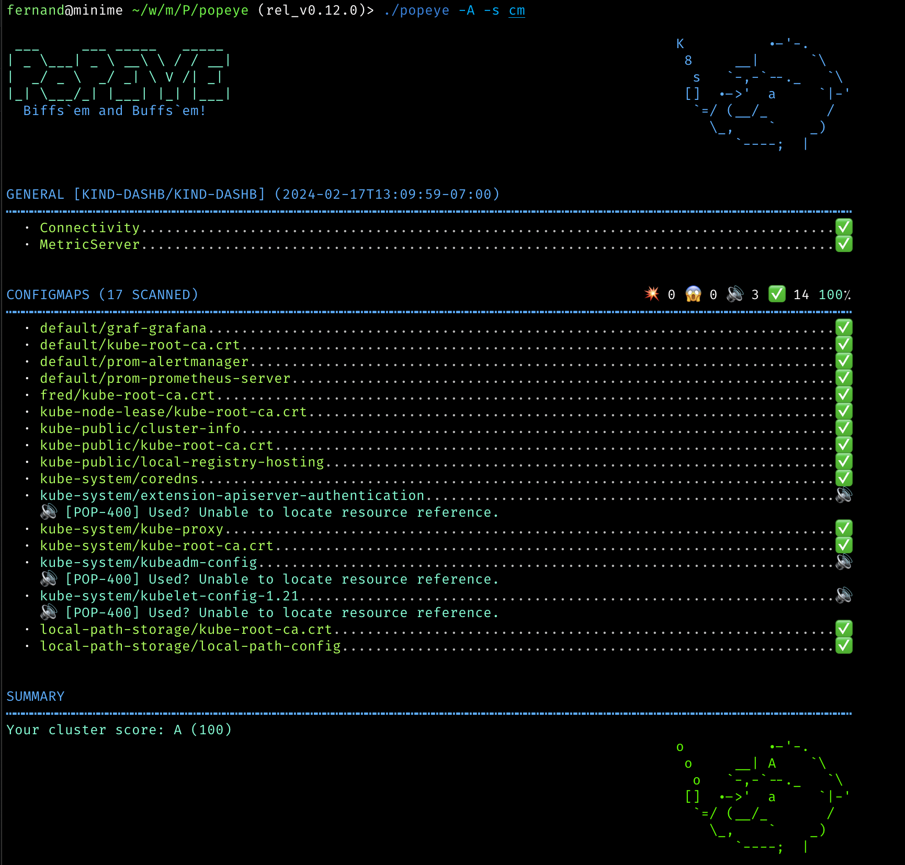
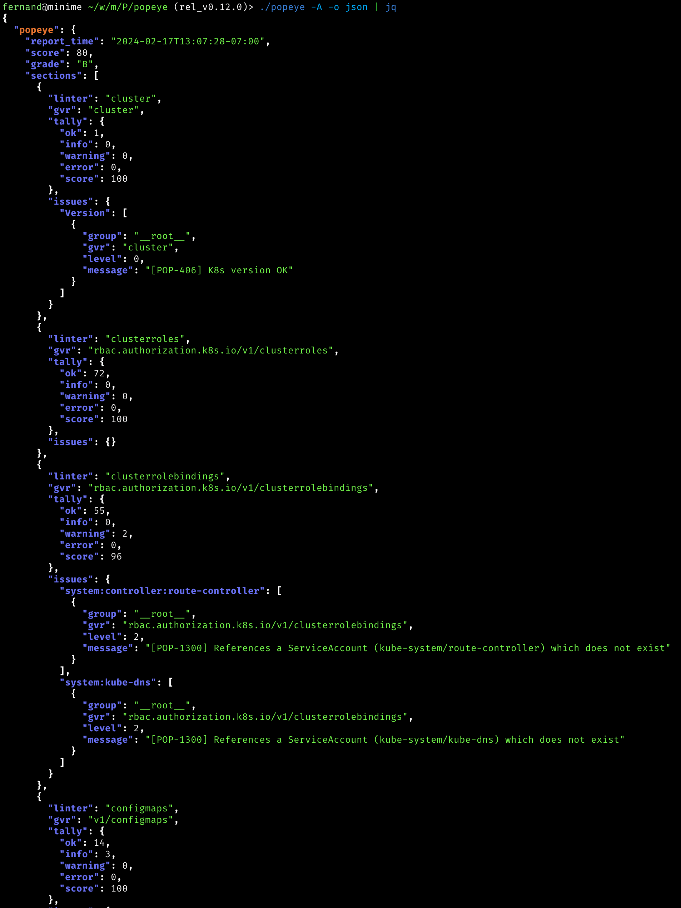
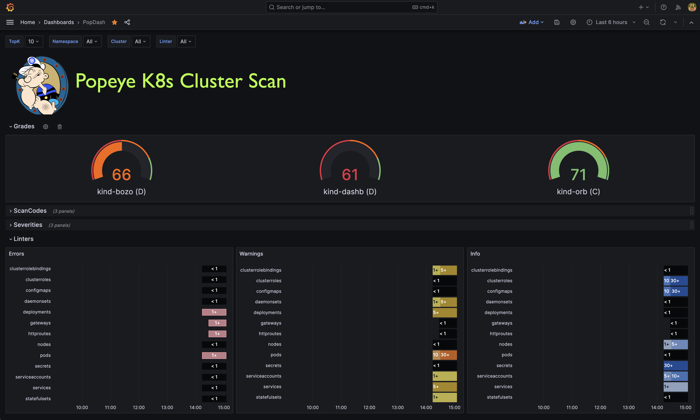

# Popeye: Kubernetes Live Cluster Linter

Popeye is a utility that scans live Kubernetes clusters and reports potential issues with deployed resources and configurations.
As Kubernetes landscapes grows, it is becoming a challenge for a human to track the slew of manifests and policies that orchestrate a cluster.
Popeye scans your cluster based on what's deployed and not what's sitting on disk. By linting your cluster, it detects misconfigurations,
stale resources and assists you to ensure that best practices are in place, thus preventing future headaches.
It aims at reducing the cognitive *over*load one faces when operating a Kubernetes cluster in the wild.
Furthermore, if your cluster employs a metric-server, it reports potential resources over/under allocations and attempts to warn you should your cluster run out of capacity.

Popeye is a readonly tool, it does not alter any of your Kubernetes resources in any way!

<br/>
<br/>

---

[](https://goreportcard.com/report/github.com/derailed/popeye)
[](https://codebeat.co/projects/github-com-derailed-popeye-master)
[](https://github.com/derailed/popeye/releases)
[](https://github.com/derailed/popeye/blob/master/LICENSE)
[](https://quay.io/repository/derailed/popeye)

[]()

---

## Screenshots

### Console



### JSON



### HTML

You can dump the scan report to HTML.


### Grafana Dashboard

Popeye publishes [Prometheus](https://prometheus.io) metrics.
We provided a sample Popeye dashboard to get you started in this repo.



---

## Installation

Popeye is available on Linux, OSX and Windows platforms.

* Binaries for Linux, Windows and Mac are available as tarballs in
  the [release](https://github.com/derailed/popeye/releases) page.

* For OSX/Unit using Homebrew/LinuxBrew

   ```shell
   brew install derailed/popeye/popeye
   ```

* Using `go install`

    ```shell
    go install github.com/derailed/popeye@latest
    ```

* Building from source
   Popeye was built using go 1.21+. In order to build Popeye from source you must:
   1. Clone the repo
   2. Add the following command in your go.mod file

      ```text
      replace (
        github.com/derailed/popeye => MY_POPEYE_CLONED_GIT_REPO
      )
      ```

   3. Build and run the executable

        ```shell
        go run main.go
        ```

   Quick recipe for the impatient:

   ```shell
   # Clone outside of GOPATH
   git clone https://github.com/derailed/popeye
   cd popeye
   # Build and install
   make build
   # Run
   popeye
   ```

## PreFlight Checks

* Popeye uses 256 colors terminal mode. On `Nix system make sure TERM is set accordingly.

    ```shell
    export TERM=xterm-256color
    ```

---

## The Command Line

You can use Popeye wide open or using a spinach yaml config to
tune your linters. Details about the Popeye configuration file are below.

```shell
# Dump version info and logs location
popeye version
# Popeye a cluster using your current kubeconfig environment.
# NOTE! This will run Popeye in the context namespace if set or like kubectl will use the default namespace
popeye
# Run Popeye in the `fred` namespace
popeye -n fred
# Run Popeye in all namespaces
popeye -A
# Run Popeye uses a spinach config file of course! aka spinachyaml!
popeye -f spinach.yaml
# Run Popeye a cluster using a kubeconfig context.
popeye --context olive
# Run Popeye with specific linters and log to the console
popeye -n ns1 -s pod,svc --logs none
# Run Popeye for a given namespace in a given log file and debug logs
popeye -n ns1 --logs /tmp/fred.log -v4
# Stuck?
popeye help
```

---

## Linters

Popeye scans your cluster for best practices and potential issues.
Currently, Popeye only looks for a given set of curated Kubernetes resources.
More will come soon!
We are hoping Kubernetes friends will pitch'in to make Popeye even better.

The aim of the linters is to pick up on misconfigurations, i.e. things
like port mismatches, dead or unused resources, metrics utilization,
probes, container images, RBAC rules, naked resources, etc...

Popeye is not another static analysis tool. It runs and inspect Kubernetes resources on
live clusters and lint resources as they are in the wild!

Here is a list of some of the available linters:

|    | Resource                | Linters                                                                 | Aliases    |
|----|-------------------------|-------------------------------------------------------------------------|------------|
| 🛀 | Node                    |                                                                         | no         |
|    |                         | Conditions ie not ready, out of mem/disk, network, pids, etc            |            |
|    |                         | Pod tolerations referencing node taints                                 |            |
|    |                         | CPU/MEM utilization metrics, trips if over limits (default 80% CPU/MEM) |            |
| 🛀 | Namespace               |                                                                         | ns         |
|    |                         | Inactive                                                                |            |
|    |                         | Dead namespaces                                                         |            |
| 🛀 | Pod                     |                                                                         | po         |
|    |                         | Pod status                                                              |            |
|    |                         | Containers statuses                                                     |            |
|    |                         | ServiceAccount presence                                                 |            |
|    |                         | CPU/MEM on containers over a set CPU/MEM limit (default 80% CPU/MEM)    |            |
|    |                         | Container image with no tags                                            |            |
|    |                         | Container image using `latest` tag                                      |            |
|    |                         | Resources request/limits presence                                       |            |
|    |                         | Probes liveness/readiness presence                                      |            |
|    |                         | Named ports and their references                                        |            |
| 🛀 | Service                 |                                                                         | svc        |
|    |                         | Endpoints presence                                                      |            |
|    |                         | Matching pods labels                                                    |            |
|    |                         | Named ports and their references                                        |            |
| 🛀 | ServiceAccount          |                                                                         | sa         |
|    |                         | Unused, detects potentially unused SAs                                  |            |
| 🛀 | Secrets                 |                                                                         | sec        |
|    |                         | Unused, detects potentially unused secrets or associated keys           |            |
| 🛀 | ConfigMap               |                                                                         | cm         |
|    |                         | Unused, detects potentially unused cm or associated keys                |            |
| 🛀 | Deployment              |                                                                         | dp, deploy |
|    |                         | Unused, pod template validation, resource utilization                   |            |
| 🛀 | StatefulSet             |                                                                         | sts        |
|    |                         | Unused, pod template validation, resource utilization                    |            |
| 🛀 | DaemonSet               |                                                                         | ds         |
|    |                         | Unused, pod template validation, resource utilization                    |            |
| 🛀 | PersistentVolume        |                                                                         | pv         |
|    |                         | Unused, check volume bound or volume error                              |            |
| 🛀 | PersistentVolumeClaim   |                                                                         | pvc        |
|    |                         | Unused, check bounded or volume mount error                             |            |
| 🛀 | HorizontalPodAutoscaler |                                                                         | hpa        |
|    |                         | Unused, Utilization, Max burst checks                                   |            |
| 🛀 | PodDisruptionBudget     |                                                                         |            |
|    |                         | Unused, Check minAvailable configuration                                | pdb        |
| 🛀 | ClusterRole             |                                                                         |            |
|    |                         | Unused                                                                  | cr         |
| 🛀 | ClusterRoleBinding      |                                                                         |            |
|    |                         | Unused                                                                  | crb        |
| 🛀 | Role                    |                                                                         |            |
|    |                         | Unused                                                                  | ro         |
| 🛀 | RoleBinding             |                                                                         |            |
|    |                         | Unused                                                                  | rb         |
| 🛀 | Ingress                 |                                                                         |            |
|    |                         | Valid                                                                   | ing        |
| 🛀 | NetworkPolicy           |                                                                         |            |
|    |                         | Valid, Stale, Guarded                                                   | np         |
| 🛀 | PodSecurityPolicy       |                                                                         |            |
|    |                         | Valid                                                                   | psp        |
| 🛀 | Cronjob                 |                                                                         |            |
|    |                         | Valid, Suspended, Runs                                                  | cj         |
| 🛀 | Job                     |                                                                         |            |
|    |                         | Pod checks                                                              | job        |
| 🛀 | GatewayClass            |                                                                         |            |
|    |                         | Valid, Unused                                                           | gwc        |
| 🛀 | Gateway                 |                                                                         |            |
|    |                         | Valid, Unused                                                           | gw         |
| 🛀 | HTTPRoute               |                                                                         |            |
|    |                         | Valid, Unused                                                           | gwr        |

You can also see the [full list of codes](docs/codes.md)

---

## Saving Scans

To save the Popeye report to a file pass the `--save` flag to the command.
By default it will create a tmp directory and will store your scan report there.
The path of the tmp directory will be printed out on STDOUT.
If you have the need to specify the output directory for the report,
you can use this environment variable `POPEYE_REPORT_DIR`. The final path will be <POPEYE_REPORT_DIR>/<cluster>/<context>.
By default, the name of the output file follow the following format : `lint_<cluster-name>_<time-UnixNano>.<output-extension>` (e.g. : "lint-mycluster-1594019782530851873.html").
If you want to also specify the output file name for the report, you can pass the `--output-file` flag with the filename you want as parameter.

Example to save report in working directory:

```shell
POPEYE_REPORT_DIR=$(pwd) popeye --save
```

Example to save report in working directory in HTML format under the name "report.html" :

```shell
POPEYE_REPORT_DIR=$(pwd) popeye --save --out html --output-file report.html
```

### Save To S3 Object Store

Alternatively, you can push the generated reports to an AWS S3 or Minio object store by providing the flag `--s3-bucket`.
For parameters you need to provide the name of the S3 bucket where you want to store the report.
To save the report in a bucket subdirectory provide the bucket parameter as `bucket/path/to/report`.

Example to save report to S3:

```shell
# AWS S3
# NOTE: You must provide env vars for AWS_ACCESS_KEY_ID and AWS_SECRET_ACCESS_KEY
# This will create bucket my-popeye if not present and upload a popeye json report to /fred/scan.json
popeye --s3-bucket s3://my-popeye/fred --s3-region us-west-2 --out json --save --output-file scan.json

# Minio Object Store
# NOTE: You must provide env vars for AWS_ACCESS_KEY_ID and AWS_SECRET_ACCESS_KEY and a minio server URI
# This will create bucket my-popeye if not present and upload a popeye json report to /fred/scan.json
popeye --s3-bucket minio://my-popeye/fred --s3-region us-east --s3-endpoint localhost:9000 --out json --save --output-file scan.json
```

---

## Docker Support

You can also run Popeye in a container by running it directly from the official docker repo on Quay.
The default command when you run the docker container is `popeye`, so you customize the scan by using the supported cli flags.
To access your clusters, map your local kubeconfig directory into the container with `-v` :

```shell
docker run --rm -it -v $HOME/.kube:/root/.kube quay.io/derailed/popeye --context foo -n bar
```

Running the above docker command with `--rm` means that the container gets deleted when Popeye exits.
When you use `--save`, it will write it to /tmp in the container and then delete the container when popeye exits, which means you lose the output ;(
To get around this, map /tmp to the container's /tmp.

> NOTE: You can override the default output directory location by setting `POPEYE_REPORT_DIR` env variable.

```shell
docker run --rm -it \
  -v $HOME/.kube:/root/.kube \
  -e POPEYE_REPORT_DIR=/tmp/popeye \
  -v /tmp:/tmp \
  quay.io/derailed/popeye --context foo -n bar --save --output-file my_report.txt

# Docker has exited, and the container has been deleted, but the file
# is in your /tmp directory because you mapped it into the container
cat /tmp/popeye/my_report.txt
<snip>
```

---

## Output Formats

Popeye can generate linter reports in a variety of formats. You can use the -o cli option and pick your poison from there.

| Format     | Description                                            | Default | Credits                                      |
|------------|--------------------------------------------------------|---------|----------------------------------------------|
| standard   | The full monty output iconized and colorized           | yes     |                                              |
| jurassic   | No icons or color like it's 1979                       |         |                                              |
| yaml       | As YAML                                                |         |                                              |
| html       | As HTML                                                |         |                                              |
| json       | As JSON                                                |         |                                              |
| junit      | For the Java melancholic                               |         |                                              |
| prometheus | Dumps report a prometheus metrics                      |         | [dardanel](https://github.com/eminugurkenar) |
| score      | Returns a single cluster linter score value (0-100)    |         | [kabute](https://github.com/kabute)          |

---

## The Prom Queen!

Popeye can publish Prometheus metrics directly from a scan. You will need to have access to a prometheus pushgateway and credentials.

> NOTE! These are subject to change based on users feedback and usage!!

In order to publish metrics, additional cli args must be present.

```shell
# Run popeye using console output and push prom metrics.
popeye --push-gtwy-url http://localhost:9091

# Run popeye using a saved html output and push prom metrics.
# NOTE! When scan are dump to disk, popeye_cluster_score metric below includes
# an additional label to track the persisted artifact so you can aggregate with the scan
# Don't think it's the correct approach as this changes the metric cardinality on every push.
# Hence open for suggestions here??
popeye -o html --save --push-gtwy-url http://localhost:9091
```

### PopProm metrics

The following Popeye prometheus metrics are published:

* `popeye_severity_total` [gauge] tracks various counts based on severity.
* `popeye_code_total` [gauge] tracks counts by Popeye's linter codes.
* `popeye_linter_tally_total` [gauge] tracks counts per linters.
* `popeye_report_errors_total` [gauge] tracks scan errors totals.
* `popeye_cluster_score` [gauge] tracks scan report scores.


### PopGraf

A sample [Grafana](https://grafana.com) dashboard can be found in this repo to get you started.

> NOTE! Work in progress, please feel free to contribute if you have UX/grafana/promql chops.


---

## SpinachYAML

A spinach YAML configuration file can be specified via the `-f` option to further configure the linters. This file may specify
the container utilization threshold and specific linter configurations as well as resources and codes that will be excluded from the linter.

> NOTE! This file will change as Popeye matures!

Under the `excludes` key you can configure to skip certain resources, or linter codes.
Popeye's linters are named after the k8s resource names.
For example the PodDisruptionBudget linter is named `poddisruptionbudgets` and scans `policy/v1/poddisruptionbudgets`

> NOTE! The linter uses the plural resource `kind` form and everything is spelled in lowercase.

A resource fully qualified name aka `FQN` is used in the spinach file to identity a resource name i.e. `namespace/resource_name`.

For example, the FQN of a pod named `fred-1234` in the namespace `blee` will be `blee/fred-1234`. This provides for differentiating `fred/p1` and `blee/p1`.
For cluster wide resources, the FQN is equivalent to the name.
Exclude rules can be either a straight string match or a regular expression. In the latter case the regular expression must be specified via the `rx:` prefix.

> NOTE! Please be careful with your regex as more resources than expected may get excluded from the report with a *loose* regex rule.
> When your cluster resources change, this could lead to a sub-optimal scans.
> Thus we recommend running Popeye `wide open` once in a while to make sure you will pick up on any new issues that may have arisen in your clusters…

Here is an example spinach file as it stands in this release.
There is a fuller eks and aks based spinach file in this repo under `spinach`.
(BTW: for new comers into the project, might be a great way to contribute by adding cluster specific spinach file PRs...)

```yaml
# spinach.yaml

# A Popeye sample configuration file
popeye:
  # Checks resources against reported metrics usage.
  # If over/under these thresholds a linter warning will be issued.
  # Your cluster must run a metrics-server for these to take place!
  allocations:
    cpu:
      underPercUtilization: 200 # Checks if cpu is under allocated by more than 200% at current load.
      overPercUtilization: 50   # Checks if cpu is over allocated by more than 50% at current load.
    memory:
      underPercUtilization: 200 # Checks if mem is under allocated by more than 200% at current load.
      overPercUtilization: 50   # Checks if mem is over allocated by more than 50% usage at current load.

  # Excludes excludes certain resources from Popeye scans
  excludes:
    # [NEW!] Global exclude resources and codes globally of any linters.
    global:
      fqns: [rx:^kube-] # => excludes all resources in kube-system, kube-public, etc..
      # [NEW!] Exclude resources for all linters matching these labels
      labels:
        app: [bozo, bono] #=> exclude any resources with labels matching either app=bozo or app=bono
      # [NEW!] Exclude resources for all linters matching these annotations
      annotations:
        fred: [blee, duh] # => exclude any resources with annotations matching either fred=blee or fred=duh
      # [NEW!] Exclude scan codes globally via straight codes or regex!
      codes: ["300", "206", "rx:^41"] # => exclude issue codes 300, 206, 410, 415 (Note: regex match!)

    # [NEW!] Configure individual resource linters
    linters:
      # Configure the namespaces linter for v1/namespaces
      namespaces:
        # [NEW!] Exclude these codes for all namespace resources straight up or via regex.
        codes: ["100", "rx:^22"] # => exclude codes 100, 220, 225, ...
        # [NEW!] Excludes specific namespaces from the scan
        instances:
          - fqns: [kube-public, kube-system] # => skip ns kube-pulbic and kube-system
          - fqns: [blee-ns]
            codes: [106] # => skip code 106 for namespace blee-ns

      # Skip secrets in namespace bozo.
      secrets:
        instances:
          - fqns: [rx:^bozo]

      # Configure the pods linter for v1/pods.
      pods:
        instances:
          # [NEW!] exclude all pods matching these labels.
          - labels:
              app: [fred,blee] # Exclude codes 102, 105 for any pods with labels app=fred or app=blee
            codes: [102, 105]

  resources:
    # Configure node resources.
    node:
      # Limits set a cpu/mem threshold in % ie if cpu|mem > limit a lint warning is triggered.
      limits:
        # CPU checks if current CPU utilization on a node is greater than 90%.
        cpu:    90
        # Memory checks if current Memory utilization on a node is greater than 80%.
        memory: 80

    # Configure pod resources
    pod:
      # Restarts check the restarts count and triggers a lint warning if above threshold.
      restarts: 3
      # Check container resource utilization in percent.
      # Issues a lint warning if about these threshold.
      limits:
        cpu:    80
        memory: 75


  # [New!] overrides code severity
  overrides:
    # Code specifies a custom severity level ie critical=3, warn=2, info=1
    - code: 206
      severity: 1

  # Configure a list of allowed registries to pull images from.
  # Any resources not using the following registries will be flagged!
  registries:
    - quay.io
    - docker.io
```

---

## In Cluster

Popeye is containerized and can be run directly in your Kubernetes clusters as a one-off or CronJob.

Here is a sample setup, please modify per your needs/wants. The manifests for this are in the k8s
directory in this repo.

```shell
kubectl apply -f k8s/popeye
```

```yaml
---
apiVersion: v1
kind: Namespace
metadata:
  name:      popeye
---
apiVersion: batch/v1
kind: CronJob
metadata:
  name:      popeye
  namespace: popeye
spec:
  schedule: "* */1 * * *" # Fire off Popeye once an hour
  concurrencyPolicy: Forbid
  jobTemplate:
    spec:
      template:
        spec:
          serviceAccountName: popeye
          restartPolicy: Never
          containers:
            - name: popeye
              image: derailed/popeye:vX.Y.Z
              imagePullPolicy: IfNotPresent
              args:
                - -o
                - yaml
                - --force-exit-zero
              resources:
                limits:
                  cpu:    500m
                  memory: 100Mi
```

The `--force-exit-zero` should be set. Otherwise, the pods will end up in an error state.

> NOTE! Popeye exits with a non-zero error code if any lint errors are detected.

### Popeye Got Your RBAC!

In order for Popeye to do his work, the signed-in user must have enough RBAC oomph to get/list the resources mentioned above.

Sample Popeye RBAC Rules (please note that those are **subject to change**.)

> NOTE! Please review and tune per your cluster policies.

```yaml
---
# Popeye ServiceAccount.
apiVersion: v1
kind:       ServiceAccount
metadata:
  name:      popeye
  namespace: popeye

---
# Popeye needs get/list access on the following Kubernetes resources.
apiVersion: rbac.authorization.k8s.io/v1
kind:       ClusterRole
metadata:
  name: popeye
rules:
- apiGroups: [""]
  resources:
   - configmaps
   - endpoints
   - namespaces
   - nodes
   - persistentvolumes
   - persistentvolumeclaims
   - pods
   - secrets
   - serviceaccounts
   - services
  verbs:     ["get", "list"]
- apiGroups: ["apps"]
  resources:
  - daemonsets
  - deployments
  - statefulsets
  - replicasets
  verbs:     ["get", "list"]
- apiGroups: ["networking.k8s.io"]
  resources:
  - ingresses
  - networkpolicies
  verbs:     ["get", "list"]
- apiGroups: ["batch.k8s.io"]
  resources:
  - cronjobs
  - jobs
  verbs:     ["get", "list"]
- apiGroups: ["gateway.networking.k8s.io"]
  resources:
  - gateway-classes
  - gateways
  - httproutes
  verbs:     ["get", "list"]
- apiGroups: ["autoscaling"]
  resources:
  - horizontalpodautoscalers
  verbs:     ["get", "list"]
- apiGroups: ["policy"]
  resources:
  - poddisruptionbudgets
  - podsecuritypolicies
  verbs:     ["get", "list"]
- apiGroups: ["rbac.authorization.k8s.io"]
  resources:
  - clusterroles
  - clusterrolebindings
  - roles
  - rolebindings
  verbs:     ["get", "list"]
- apiGroups: ["metrics.k8s.io"]
  resources:
  - pods
  - nodes
  verbs:     ["get", "list"]

---
# Binds Popeye to this ClusterRole.
apiVersion: rbac.authorization.k8s.io/v1
kind:       ClusterRoleBinding
metadata:
  name: popeye
subjects:
- kind:     ServiceAccount
  name:     popeye
  namespace: popeye
roleRef:
  kind:     ClusterRole
  name:     popeye
  apiGroup: rbac.authorization.k8s.io
```

---

## Report Morphology

The lint report outputs each resource group scanned and their potential issues.
The report is color/emoji coded in term of linter severity levels:

| Level | Icon | Jurassic | Color     | Description     |
|-------|------|----------|-----------|-----------------|
| Ok    | ✅   | OK       | Green     | Happy!          |
| Info  | 🔊   | I        | BlueGreen | FYI             |
| Warn  | 😱   | W        | Yellow    | Potential Issue |
| Error | 💥   | E        | Red       | Action required |

The heading section for each scanned Kubernetes resource provides a summary count
for each of the categories above.

The Summary section provides a **Popeye Score** based on the linter pass on the given cluster.

---

## Known Issues

This initial drop is brittle. Popeye will most likely blow up when…

* You're running older versions of Kubernetes. Popeye works best with Kubernetes 1.25.X.
* You don't have enough RBAC oomph to manage your cluster (see RBAC section)

---

## Disclaimer

This is work in progress! If there is enough interest in the Kubernetes
community, we will enhance per your recommendations/contributions.
Also if you dig this effort, please let us know that too!

---

## ATTA Girls/Boys!

Popeye sits on top of many of open source projects and libraries. Our *sincere*
appreciations to all the OSS contributors that work nights and weekends
to make this project a reality!

### Contact Info

1. **Email**:   fernand@imhotep.io
2. **Twitter**: [@kitesurfer](https://twitter.com/kitesurfer?lang=en)

---

  &nbsp;© 2025 Imhotep Software LLC.
All materials licensed under [Apache v2.0](http://www.apache.org/licenses/LICENSE-2.0)
