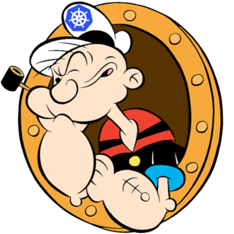

# Popeye - A Kubernetes Cluster Sanitizer

Popeye is a utility that scans live Kubernetes cluster and reports potential issues with deployed resources and configurations. It sanitizes your cluster based on what's deployed and not what's sitting on disk. By scanning your cluster, it detects misconfigurations and ensure best practices are in place thus preventing potential future headaches. It aims at reducing the cognitive *over*load one faces when operating a Kubernetes cluster in the wild. Furthermore, if your cluster employs a metric-server, it reports potential resources over/under allocations and attempts to warn you should your cluster run out of capacity.

Popeye is a readonly tool, it does not alter any of your Kubernetes resources in any way!

<br/>
<br/>

---

[](https://goreportcard.com/report/github.com/derailed/popeye)
[](https://travis-ci.com/derailed/popeye)
[](https://github.com/derailed/popeye/releases)
[](https://github.com/mum4k/termdash/blob/master/LICENSE)
<!-- [](https://snapcraft.io/popeye) -->

---

## Installation

Popeye is available on Linux, OSX and Windows platforms.

* Binaries for Linux, Windows and Mac are available as tarballs in
  the [release](https://github.com/derailed/popeye/releases) page or
  via the SnapCraft link above.

* For OSX using Homebrew

   ```shell
   brew tap derailed/popeye && brew install popeye
   ```

* Building from source
   Popeye was built using go 1.12+. In order to build Popeye from source you must:
   1. Clone the repo
   2. Set env var *GO111MODULE=on*
   3. Add the following command in your go.mod file

      ```text
      replace (
        github.com/derailed/popeye => MY_POPEYE_CLONED_GIT_REPO
      )
      ```

   4. Build and run the executable

        ```shell
        go run main.go
        ```

   Quick recipe for the impatient:

   ```shell
   git clone https://github.com/derailed/popeye ;# clone outside of GOPATH
   cd popeye
   go install ;# build and install
   popeye     ;# run
   ```

## Sanitizers

Popeye scans your cluster for best practices and potential issues.
Currently, Popeye only looks at nodes, namespaces, pods and services.
More will come soon! We are hoping Kubernetes friends will pitch'in
to make Popeye even better.

The aim of the sanitizers is to pick up on misconfigurations ie things
like ports mismatch, dead or unused resources, metrics utilization,
probes, container images, RBAC rules, naked resources, etc...

Popeye is not another static analysis tool. It runs and inspect Kubernetes resources on
live clusters and sanitize resources as they are in the wild!

Here is a list of sanitizers in place for the current release.


|    | Resource                | Sanitizers                                                              | Section |
|----|-------------------------|-------------------------------------------------------------------------|---------|
| 🛀 | Node                    |                                                                         | no      |
|    |                         | Conditions ie not ready, out of mem/disk, network, pids, etc            |         |
|    |                         | Pod tolerations referencing node taints                                 |         |
|    |                         | CPU/MEM utilization metrics, trips if over limits (default 80% CPU/MEM) |         |
| 🛀 | Namespace               |                                                                         | ns      |
|    |                         | Inactive                                                                |         |
|    |                         | Dead namespaces                                                         |         |
| 🛀 | Pod                     |                                                                         | po      |
|    |                         | Pod status                                                              |         |
|    |                         | Containers statuses                                                     |         |
|    |                         | ServiceAccount presence                                                 |         |
|    |                         | CPU/MEM on containers over a set CPU/MEM limit (default 80% CPU/MEM)    |         |
|    |                         | Container image with no tags                                            |         |
|    |                         | Container image using `latest` tag                                      |         |
|    |                         | Resources request/limits presence                                       |         |
|    |                         | Probes liveness/readiness presence                                      |         |
|    |                         | Named ports and their references                                        |         |
| 🛀 | Service                 |                                                                         | svc     |
|    |                         | Endpoints presence                                                      |         |
|    |                         | Matching pods labels                                                    |         |
|    |                         | Named ports and their references                                        |         |
| 🛀 | ServiceAccount          |                                                                         | sa      |
|    |                         | Unused, detects potentially unused SAs                                  |         |
| 🛀 | Secrets                 |                                                                         | sec     |
|    |                         | Unused, detects potentially unused secrets or associated keys           |         |
| 🛀 | ConfigMap               |                                                                         | cm      |
|    |                         | Unused, detects potentially unused cm or associated keys                |         |
| 🛀 | Deployment              |                                                                         | dp      |
|    |                         | Unused, pod template validation, resource utilization                   |         |
| 🛀 | StatefulSet             |                                                                         | sts     |
|    |                         | Unsed, pod template validation, resource utilization                    |         |
| 🛀 | PersistentVolume        |                                                                         | pv      |
|    |                         | Unused, check volume bound or volume error                              |         |
| 🛀 | PersistentVolumeClaim   |                                                                         | pvc     |
|    |                         | Unused, check bounded or volume mount error                             |         |
| 🛀 | HorizontalPodAutoscaler |                                                                         | hpa     |
|    |                         | Unused, Utilization, Max burst checks                                   |         |


## The Command Line

You can use Popeye standalone or using a spinach yaml config to
tune the sanitizer. Details about the Popeye configuration file are below.

```shell
# Dump version info
popeye version
# Popeye a cluster using your current kubeconfig environment.
popeye
# Popeye uses a spinach config file of course! aka spinachyaml!
popeye -f spinach.yml
# Popeye a cluster using a kubeconfig context.
popeye --context olive
# Stuck?
popeye help
```

## Popeye In Cluster...

Alternatively, Popeye can be run directly on your Kubernetes clusters as a single shot or cronjob.

Here is a sample setup, please modify per your needs/wants. The manifests for this are in the k8s
directory in this repo.

```shell
kubectl apply -f k8s/popeye/ns.yml && kubectl apply -f k8s/popeye
```

```yaml
---
apiVersion: batch/v1beta1
kind: CronJob
metadata:
  name:      popeye
  namespace: popeye
spec:
  schedule: "* */1 * * *" # Fireoff Popeye once an hour
  concurrencyPolicy: Forbid
  jobTemplate:
    spec:
      template:
        spec:
          serviceAccountName: popeye
          restartPolicy: Never
          containers:
            - name: popeye
              image: derailed/popeye:v0.3.3
              imagePullPolicy: IfNotPresent
              args:
                - -o
                - yaml
              resources:
                limits:
                  cpu:    500m
                  memory: 100Mi
```

## Popeye got your RBAC!

In order for Popeye to do his work, the signed in user must have enough RBAC oomph to
get/list the resources mentioned above.

Sample Popeye RBAC Rules (Subject to change!!)

```yaml
---
# Popeye ServiceAccount.
apiVersion: v1
kind:       ServiceAccount
metadata:
  name:      popeye
  namespace: popeye

# Popeye needs get/list access on the following Kubernetes resources.
apiVersion: rbac.authorization.k8s.io/v1
kind:       ClusterRole
metadata:
  name: popeye
rules:
- apiGroups: [""]
  resources:
   - configmaps
   - deployments
   - endpoints
   - horizontalpodautoscalers
   - namespaces
   - nodes
   - persistentvolumes
   - persistentvolumeclaims
   - pods
   - secrets
   - serviceaccounts
   - services
   - statefulsets
  verbs:     ["get", "list"]
- apiGroups: ["rbac.authorization.k8s.io"]
  resources:
  - clusterroles
  - clusterrolebindings
  - roles
  - rolebindings
  verbs:     ["get", "list"]
- apiGroups: ["metrics.k8s.io"]
  resources:
  - pods
  - nodes
  verbs:     ["get", "list"]

---
# Binds Popeye to this ClusterRole.
apiVersion: rbac.authorization.k8s.io/v1
kind:       ClusterRoleBinding
metadata:
  name: popeye
subjects:
- kind:     ServiceAccount
  name:     popeye
  namespace: popeye
roleRef:
  kind:     ClusterRole
  name:     popeye
  apiGroup: rbac.authorization.k8s.io
```

## Screenshots

### Cluster D Score


### Cluster A Score


## The SpinachYAML Configuration

NOTE: This file will change as Popeye matures!

```yaml
# A Popeye sample configuration file
popeye:
  # Checks allocations and trip report based on over or under allocations for CPU and Memory.
  allocations:
    cpu:
      over: 100
      under: 50
    memory:
      over: 100
      under: 50

  # Configure node resources.
  node:
    # Limits set a cpu/mem threshold in % ie if cpu|mem > limit a lint warning is triggered.
    limits:
      # CPU checks if current CPU utilization on a node is greater than 90%.
      cpu:    90
      # Memory checks if current Memory utilization on a node is greater than 80%.
      memory: 80
    # Exclude lists node names to exclude from the scan.
    exclude:
    - master

  # Configure namespace resources
  namespace:
    # Exclude list out namespaces to be excluded from the scan.
    exclude:
      - kube-system
      - kube-public

  # Configure pod resources
  pod:
    # Restarts check the restarts count and triggers a lint warning if above threshold.
    restarts:
      3
    # Check container resource utilization in percent.
    # Issues a lint warning if about these threshold.
    limits:
      cpu:    80
      memory: 75

  # Service ...
  service:
    # Excludes these services from the scan.
    exclude:
      - default/kubernetes
      - blee-ns/fred
```

## Report Morphology

The sanitizer report outputs each resource group scanned and their potential issues.
The report is color/emoji coded in term of Sanitizer severity levels:

| Level | Icon | Jurassic | Color     | Description     |
|-------|------|----------|-----------|-----------------|
| Ok    | ✅    | OK       | Green     | Happy!          |
| Info  | 🔊   | I        | BlueGreen | FYI             |
| Warn  | 😱   | W        | Yellow    | Potential Issue |
| Error | 💥   | E        | Red       | Action required |

The heading section for each Kubenertes resource scanned,  provides an issue rollup summary count
for each of the categories above.

The Summary section provides a **Popeye Score** based on the sanitization pass on the given cluster.

## Known Issues

This initial drop is brittle. Popeye will most likely blow up...

* You're running older versions of Kubernetes. Popeye works best Kubernetes 1.13+.
* You don't have enough RBAC fu to manage your cluster (see RBAC section)

## Disclaimer

This is work in progress! If there is enough interest in the Kubernetes
community, we will enhance per your recommendations/contributions. Also if you
dig this effort, please let us know that too!

## ATTA Girls/Boys!

Popeye sits on top of many of opensource projects and libraries. Our *sincere*
appreciations to all the OSS contributors that work nights and weekends
to make this project a reality!

## Contact Info

1. **Email**:   fernand@imhotep.io
2. **Twitter**: [@kitesurfer](https://twitter.com/kitesurfer?lang=en)

---

  &nbsp;© 2019 Imhotep Software LLC.
All materials licensed under [Apache v2.0](http://www.apache.org/licenses/LICENSE-2.0)
