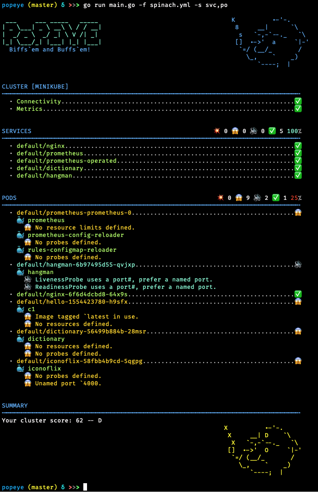

# Popeye - A Kubernetes Cluster Sanitizer

Popeye is a utility that scans live Kubernetes cluster and reports potential issues with deployed resources and configurations. It sanitizes your cluster based on what's deployed and not what's sitting on disk. By scanning your cluster, it detects misconfigurations and helps you to ensure that best practices are in place, thus preventing future headaches. It aims at reducing the cognitive *over*load one faces when operating a Kubernetes cluster in the wild. Furthermore, if your cluster employs a metric-server, it reports potential resources over/under allocations and attempts to warn you should your cluster run out of capacity.

Popeye is a readonly tool, it does not alter any of your Kubernetes resources in any way!

<br/>
<br/>

---

[](https://goreportcard.com/report/github.com/derailed/popeye)
[](https://codebeat.co/projects/github-com-derailed-popeye-master)
[](https://travis-ci.com/derailed/popeye)
[](https://github.com/derailed/popeye/releases)
[](https://github.com/derailed/popeye/blob/master/LICENSE)
[](https://hub.docker.com/r/derailed/popeye/builds)

[]()

---

[](https://gitpod.io/#https://github.com/derailed/popeye)

## Installation

Popeye is available on Linux, OSX and Windows platforms.

* Binaries for Linux, Windows and Mac are available as tarballs in
  the [release](https://github.com/derailed/popeye/releases) page.

* For OSX/Unit using Homebrew/LinuxBrew

   ```shell
   brew install derailed/popeye/popeye
   ```

* Building from source
   Popeye was built using go 1.12+. In order to build Popeye from source you must:
   1. Clone the repo
   2. Add the following command in your go.mod file

      ```text
      replace (
        github.com/derailed/popeye => MY_POPEYE_CLONED_GIT_REPO
      )
      ```

   3. Build and run the executable

        ```shell
        go run main.go
        ```

   Quick recipe for the impatient:

   ```shell
   # Clone outside of GOPATH
   git clone https://github.com/derailed/popeye
   cd popeye
   # Build and install
   go install
   # Run
   popeye
   ```

## PreFlight Checks

* Popeye uses 256 colors terminal mode. On `Nix system make sure TERM is set accordingly.

    ```shell
    export TERM=xterm-256color
    ```

## Sanitizers

Popeye scans your cluster for best practices and potential issues.
Currently, Popeye only looks at nodes, namespaces, pods and services.
More will come soon! We are hoping Kubernetes friends will pitch'in
to make Popeye even better.

The aim of the sanitizers is to pick up on misconfigurations, i.e. things
like port mismatches, dead or unused resources, metrics utilization,
probes, container images, RBAC rules, naked resources, etc...

Popeye is not another static analysis tool. It runs and inspect Kubernetes resources on
live clusters and sanitize resources as they are in the wild!

Here is a list of some of the available sanitizers:


|    | Resource                | Sanitizers                                                              | Aliases    |
|----|-------------------------|-------------------------------------------------------------------------|------------|
| 🛀 | Node                    |                                                                         | no         |
|    |                         | Conditions ie not ready, out of mem/disk, network, pids, etc            |            |
|    |                         | Pod tolerations referencing node taints                                 |            |
|    |                         | CPU/MEM utilization metrics, trips if over limits (default 80% CPU/MEM) |            |
| 🛀 | Namespace               |                                                                         | ns         |
|    |                         | Inactive                                                                |            |
|    |                         | Dead namespaces                                                         |            |
| 🛀 | Pod                     |                                                                         | po         |
|    |                         | Pod status                                                              |            |
|    |                         | Containers statuses                                                     |            |
|    |                         | ServiceAccount presence                                                 |            |
|    |                         | CPU/MEM on containers over a set CPU/MEM limit (default 80% CPU/MEM)    |            |
|    |                         | Container image with no tags                                            |            |
|    |                         | Container image using `latest` tag                                      |            |
|    |                         | Resources request/limits presence                                       |            |
|    |                         | Probes liveness/readiness presence                                      |            |
|    |                         | Named ports and their references                                        |            |
| 🛀 | Service                 |                                                                         | svc        |
|    |                         | Endpoints presence                                                      |            |
|    |                         | Matching pods labels                                                    |            |
|    |                         | Named ports and their references                                        |            |
| 🛀 | ServiceAccount          |                                                                         | sa         |
|    |                         | Unused, detects potentially unused SAs                                  |            |
| 🛀 | Secrets                 |                                                                         | sec        |
|    |                         | Unused, detects potentially unused secrets or associated keys           |            |
| 🛀 | ConfigMap               |                                                                         | cm         |
|    |                         | Unused, detects potentially unused cm or associated keys                |            |
| 🛀 | Deployment              |                                                                         | dp, deploy |
|    |                         | Unused, pod template validation, resource utilization                   |            |
| 🛀 | StatefulSet             |                                                                         | sts        |
|    |                         | Unsed, pod template validation, resource utilization                    |            |
| 🛀 | DaemonSet               |                                                                         | ds         |
|    |                         | Unsed, pod template validation, resource utilization                    |            |
| 🛀 | PersistentVolume        |                                                                         | pv         |
|    |                         | Unused, check volume bound or volume error                              |            |
| 🛀 | PersistentVolumeClaim   |                                                                         | pvc        |
|    |                         | Unused, check bounded or volume mount error                             |            |
| 🛀 | HorizontalPodAutoscaler |                                                                         | hpa        |
|    |                         | Unused, Utilization, Max burst checks                                   |            |
| 🛀 | PodDisruptionBudget     |                                                                         |            |
|    |                         | Unused, Check minAvailable configuration                                | pdb        |
| 🛀 | ClusterRole             |                                                                         |            |
|    |                         | Unused                                                                  | cr         |
| 🛀 | ClusterRoleBinding      |                                                                         |            |
|    |                         | Unused                                                                  | crb        |
| 🛀 | Role                    |                                                                         |            |
|    |                         | Unused                                                                  | ro         |
| 🛀 | RoleBinding             |                                                                         |            |
|    |                         | Unused                                                                  | rb         |
| 🛀 | Ingress                 |                                                                         |            |
|    |                         | Valid                                                                   | ing        |
| 🛀 | NetworkPolicy           |                                                                         |            |
|    |                         | Valid                                                                   | np         |
| 🛀 | PodSecurityPolicy       |                                                                         |            |
|    |                         | Valid                                                                   | psp        |

You can also see the [full list of codes](docs/codes.md)

### Save the report

To save the Popeye report to a file pass the `--save` flag to the command.
By default it will create a temp directory and will store the report there,
the path of the temp directory will be printed out on STDOUT.
If you have the need to specify the output directory for the report,
you can use the environment variable `POPEYE_REPORT_DIR`.
By default, the name of the output file follow the following format : `sanitizer_<cluster-name>_<time-UnixNano>.<output-extension>` (e.g. : "sanitizer-mycluster-1594019782530851873.html").
If you have the need to specify the output file name for the report,
you can pass the `--output-file` flag with the filename you want as parameter.

Example to save report in working directory:

```shell
  $ POPEYE_REPORT_DIR=$(pwd) popeye --save
```

Example to save report in working directory in HTML format under the name "report.html" :

```shell
  $ POPEYE_REPORT_DIR=$(pwd) popeye --save --out html --output-file report.html
```

### Save the report to S3

You can also save the generated report to an AWS S3 bucket (or another S3 compatible Object Storage) with providing the flag `--s3-bucket`. As parameter you need to provide the name of the S3 bucket where you want to store the report.
To save the report in a bucket subdirectory provide the bucket parameter as `bucket/path/to/report`.

Underlying the AWS Go lib is used which is handling the credential loading. For more information check out the official [documentation](https://docs.aws.amazon.com/sdk-for-go/api/aws/session/).

Example to save report to S3:

```shell
popeye --s3-bucket=NAME-OF-YOUR-S3-BUCKET/OPTIONAL/SUBDIRECTORY --out=json
```

If AWS sS3 is not your bag, you can further define an S3 compatible storage (OVHcloud Object Storage, Minio, Google cloud storage, etc...) using s3-endpoint and s3-region as so:

```shell
popeye --s3-bucket=NAME-OF-YOUR-S3-BUCKET/OPTIONAL/SUBDIRECTORY --s3-region YOUR-REGION --s3-endpoint URL-OF-THE-ENDPOINT
```

### Run public Docker image locally

You don't have to build and/or install the binary to run popeye: you can just
run it directly from the official docker repo on DockerHub. The default command
when you run the docker container is `popeye`, so you just need to pass
whatever cli args are normally passed to popeye.  To access your clusters, map
your local kube config directory into the container with `-v` :

```shell
  docker run --rm -it \
    -v $HOME/.kube:/root/.kube \
    derailed/popeye --context foo -n bar
```

Running the above docker command with `--rm` means that the container gets
deleted when popeye exits. When you use `--save`, it will write it to /tmp in
the container and then delete the container when popeye exits, which means you
lose the output. To get around this, map /tmp to the container's /tmp.
NOTE: You can override the default output directory location by setting `POPEYE_REPORT_DIR` env variable.

```shell
  docker run --rm -it \
    -v $HOME/.kube:/root/.kube \
    -e POPEYE_REPORT_DIR=/tmp/popeye \
    -v /tmp:/tmp \
    derailed/popeye --context foo -n bar --save --output-file my_report.txt

  # Docker has exited, and the container has been deleted, but the file
  # is in your /tmp directory because you mapped it into the container
  $ cat /tmp/popeye/my_report.txt
    <snip>
```

## The Command Line

You can use Popeye standalone or using a spinach yaml config to
tune the sanitizer. Details about the Popeye configuration file are below.

```shell
# Dump version info
popeye version
# Popeye a cluster using your current kubeconfig environment.
popeye
# Popeye uses a spinach config file of course! aka spinachyaml!
popeye -f spinach.yml
# Popeye a cluster using a kubeconfig context.
popeye --context olive
# Stuck?
popeye help
```

## Output Formats

Popeye can generate sanitizer reports in a variety of formats. You can use the -o cli option and pick your poison from there.

| Format     | Description                                            | Default | Credits                                      |
|------------|--------------------------------------------------------|---------|----------------------------------------------|
| standard   | The full monty output iconized and colorized           | yes     |                                              |
| jurassic   | No icons or color like it's 1979                       |         |                                              |
| yaml       | As YAML                                                |         |                                              |
| html       | As HTML                                                |         |                                              |
| json       | As JSON                                                |         |                                              |
| junit      | For the Java melancholic                               |         |                                              |
| prometheus | Dumps report a prometheus scrappable metrics           |         | [dardanel](https://github.com/eminugurkenar) |
| score      | Returns a single cluster sanitizer score value (0-100) |         | [kabute](https://github.com/kabute)          |

## The SpinachYAML Configuration

A spinach.yml configuration file can be specified via the `-f` option to further configure the sanitizers. This file may specify
the container utilization threshold and specific sanitizer configurations as well as resources that will be excluded from the sanitization.

NOTE: This file will change as Popeye matures!

Under the `excludes` key you can configure to skip certain resources, or certain checks by code. Here, resource types are indicated in a group/version/resource notation. Example: to exclude PodDisruptionBugdets, use the notation `policy/v1/poddisruptionbudgets`. Note that the resource name is written in the plural form and everything is spelled in lowercase. For resources without an API group, the group part is omitted (Examples: `v1/pods`, `v1/services`, `v1/configmaps`).

A resource is identified by a resource kind and a fully qualified resource name, i.e. `namespace/resource_name`.

For example, the FQN of a pod named `fred-1234` in the namespace `blee` will be `blee/fred-1234`. This provides for differentiating `fred/p1` and `blee/p1`. For cluster wide resources, the FQN is equivalent to the name. Exclude rules can have either a straight string match or a regular expression. In the latter case the regular expression must be indicated using the `rx:` prefix.

NOTE! Please be careful with your regex as more resources than expected may get excluded from the report with a *loose* regex rule. When your cluster resources change, this could lead to a sub-optimal sanitization. Once in a while it might be a good idea to run Popeye „configless“ to make sure you will recognize any new issues that may have arisen in your clusters…

Here is an example spinach file as it stands in this release. There is a fuller eks and aks based spinach file in this repo under `spinach`. (BTW: for new comers into the project, might be a great way to contribute by adding cluster specific spinach file PRs...)

```yaml
# A Popeye sample configuration file
popeye:
  # Checks resources against reported metrics usage.
  # If over/under these thresholds a sanitization warning will be issued.
  # Your cluster must run a metrics-server for these to take place!
  allocations:
    cpu:
      underPercUtilization: 200 # Checks if cpu is under allocated by more than 200% at current load.
      overPercUtilization: 50   # Checks if cpu is over allocated by more than 50% at current load.
    memory:
      underPercUtilization: 200 # Checks if mem is under allocated by more than 200% at current load.
      overPercUtilization: 50   # Checks if mem is over allocated by more than 50% usage at current load.

  # Excludes excludes certain resources from Popeye scans
  excludes:
    v1/pods:
    # In the monitoring namespace excludes all probes check on pod's containers.
    - name: rx:monitoring
      codes:
      - 102
    # Excludes all istio-proxy container scans for pods in the icx namespace.
    - name: rx:icx/.*
      containers:
        # Excludes istio init/sidecar container from scan!
        - istio-proxy
        - istio-init
    # ConfigMap sanitizer exclusions...
    v1/configmaps:
      # Excludes key must match the singular form of the resource.
      # For instance this rule will exclude all configmaps named fred.v2.3 and fred.v2.4
      - name: rx:fred.+\.v\d+
    # Namespace sanitizer exclusions...
    v1/namespaces:
      # Exclude all fred* namespaces if the namespaces are not found (404), other error codes will be reported!
      - name: rx:kube
        codes:
          - 404
      # Exclude all istio* namespaces from being scanned.
      - name: rx:istio
    # Completely exclude horizontal pod autoscalers.
    autoscaling/v1/horizontalpodautoscalers:
      - name: rx:.*

  # Configure node resources.
  node:
    # Limits set a cpu/mem threshold in % ie if cpu|mem > limit a lint warning is triggered.
    limits:
      # CPU checks if current CPU utilization on a node is greater than 90%.
      cpu:    90
      # Memory checks if current Memory utilization on a node is greater than 80%.
      memory: 80

  # Configure pod resources
  pod:
    # Restarts check the restarts count and triggers a lint warning if above threshold.
    restarts:
      3
    # Check container resource utilization in percent.
    # Issues a lint warning if about these threshold.
    limits:
      cpu:    80
      memory: 75

  # Configure a list of allowed registries to pull images from
  registries:
    - quay.io
    - docker.io
```

## Popeye In Your Clusters!

Alternatively, Popeye is containerized and can be run directly in your Kubernetes clusters as a one-off or CronJob.

Here is a sample setup, please modify per your needs/wants. The manifests for this are in the k8s
directory in this repo.

```shell
kubectl apply -f k8s/popeye/ns.yml && kubectl apply -f k8s/popeye
```

```yaml
---
apiVersion: batch/v1
kind: CronJob
metadata:
  name:      popeye
  namespace: popeye
spec:
  schedule: "* */1 * * *" # Fire off Popeye once an hour
  concurrencyPolicy: Forbid
  jobTemplate:
    spec:
      template:
        spec:
          serviceAccountName: popeye
          restartPolicy: Never
          containers:
            - name: popeye
              image: derailed/popeye
              imagePullPolicy: IfNotPresent
              args:
                - -o
                - yaml
                - --force-exit-zero
                - true
              resources:
                limits:
                  cpu:    500m
                  memory: 100Mi
```

The `--force-exit-zero` should be set to `true`. Otherwise, the pods will end up in an error state. Note that popeye
exits with a non-zero error code if the report has any errors.


## Popeye got your RBAC!

In order for Popeye to do his work, the signed-in user must have enough RBAC oomph to
get/list the resources mentioned above.

Sample Popeye RBAC Rules (please note that those are **subject to change**.)

```yaml
---
# Popeye ServiceAccount.
apiVersion: v1
kind:       ServiceAccount
metadata:
  name:      popeye
  namespace: popeye

---
# Popeye needs get/list access on the following Kubernetes resources.
apiVersion: rbac.authorization.k8s.io/v1
kind:       ClusterRole
metadata:
  name: popeye
rules:
- apiGroups: [""]
  resources:
   - configmaps
   - deployments
   - endpoints
   - horizontalpodautoscalers
   - namespaces
   - nodes
   - persistentvolumes
   - persistentvolumeclaims
   - pods
   - secrets
   - serviceaccounts
   - services
   - statefulsets
  verbs:     ["get", "list"]
- apiGroups: ["rbac.authorization.k8s.io"]
  resources:
  - clusterroles
  - clusterrolebindings
  - roles
  - rolebindings
  verbs:     ["get", "list"]
- apiGroups: ["metrics.k8s.io"]
  resources:
  - pods
  - nodes
  verbs:     ["get", "list"]

---
# Binds Popeye to this ClusterRole.
apiVersion: rbac.authorization.k8s.io/v1
kind:       ClusterRoleBinding
metadata:
  name: popeye
subjects:
- kind:     ServiceAccount
  name:     popeye
  namespace: popeye
roleRef:
  kind:     ClusterRole
  name:     popeye
  apiGroup: rbac.authorization.k8s.io
```

## Screenshots

### Cluster D Score



### Cluster A Score


## Report Morphology

The sanitizer report outputs each resource group scanned and their potential issues.
The report is color/emoji coded in term of Sanitizer severity levels:

| Level | Icon | Jurassic | Color     | Description     |
|-------|------|----------|-----------|-----------------|
| Ok    | ✅    | OK       | Green     | Happy!          |
| Info  | 🔊   | I        | BlueGreen | FYI             |
| Warn  | 😱   | W        | Yellow    | Potential Issue |
| Error | 💥   | E        | Red       | Action required |

The heading section for each scanned Kubernetes resource provides a summary count
for each of the categories above.

The Summary section provides a **Popeye Score** based on the sanitization pass on the given cluster.

## Known Issues

This initial drop is brittle. Popeye will most likely blow up when…

* You're running older versions of Kubernetes. Popeye works best with Kubernetes 1.13+.
* You don't have enough RBAC oomph to manage your cluster (see RBAC section)

## Disclaimer

This is work in progress! If there is enough interest in the Kubernetes
community, we will enhance per your recommendations/contributions. Also if you
dig this effort, please let us know that too!

## ATTA Girls/Boys!

Popeye sits on top of many of open source projects and libraries. Our *sincere*
appreciations to all the OSS contributors that work nights and weekends
to make this project a reality!

## Contact Info

1. **Email**:   fernand@imhotep.io
2. **Twitter**: [@kitesurfer](https://twitter.com/kitesurfer?lang=en)

---

  &nbsp;© 2020 Imhotep Software LLC.
All materials licensed under [Apache v2.0](http://www.apache.org/licenses/LICENSE-2.0)
